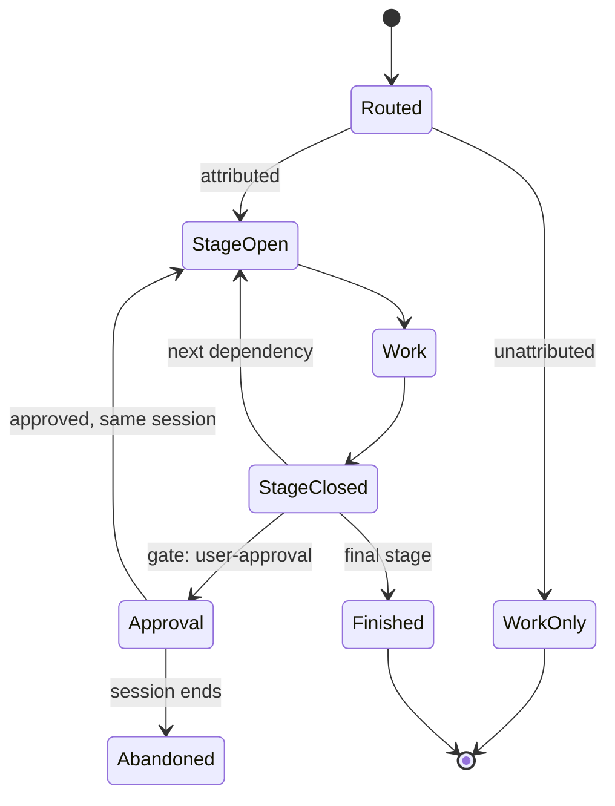

# Coredoc workflow router

Resolve `<plugin-root>` as two directories above this file. Repository rules and
the user's authorization boundary always win; plugin skills are methods, not
extra authority or implicit dependencies.

## Route once

Classify intent as `direct`, `diagnose`, `design`, `change`, `review`, `spec`,
`qa`, `qa-report`, `benchmark`, `security`, `browse`, `learn`, or `retro`; risk
as `low|normal|high`; and scale as `large` only when creating a component or
subsystem, changing a shared/cross-package contract, or requiring multiple test
surfaces. The compact override is `--scale large`. Mark bug, data, and runtime
sensitivity only when present.

If the user supplied a Jira/Notion/GitHub or similar relation intended as a work
item, first read and apply
`<plugin-root>/resources/methodology/work-item-routing.md`. Otherwise do not load
that protocol and emit no work-item arguments.

Run exactly once:

```text
<plugin-root>/bin/coredoc-workflows route-task --intent <intent> --risk <risk> --scale <normal|large>
  [--bug-like] [--data-sensitive] [--runtime-sensitive]
  [verified work-item groups]
```

Pass values as separate process arguments; never interpolate raw user text into
shell source. Never pass `--task-id`: it is only for programmatic task-owning invokers
holding a server-issued canonical ID. A prompt value, URL, visible key, branch,
or inferred ID must never be forwarded. `route-task --task <text>` is available
only when a host can pass the text as a safely separated argument.

On Codex, use `sandbox_permissions: "require_escalated"` for this trusted
`coredoc-workflows route-task` command. Managed capture uses loopback
`127.0.0.1:43181`, which the sandbox denies; do not try it sandboxed first. This
elevation applies only to the plugin command and never broadens task authority.

Keep the returned `runId`, route, and `runStateStatus`. Capture is fail-open after
its capability preflight. If `runStateStatus` is `unattributed`, state that the
host cannot provide the completion gate, execute the stage methods, and skip all
`coredoc-workflows stage-run` and `finish-run` commands.

Tell the user the selected route in one sentence. Preflight available tools for
a delimited `Coredoc` MCP namespace. If absent, say graph grounding is
unavailable, mention the project's `.mcp.json` or `claude mcp add`, then continue.
Pass `capability-missing` at finish. For a large route with graph tools, run one
relevant callers/dependents/impact query, treat coverage as a lower bound, and
manually verify critical consumers.

For `scale: large` or a multi-stage route, inspect available non-plugin skills,
show up to three relevant candidates, and ask once whether to add them as
context. Invoke and later require only explicitly approved skills.

## Execute the returned DAG

Gather only `contextProviders`, then execute stages in dependency order with the
named plugin skills. Use independent tool calls in parallel only when they do
not share state; serialize dependencies, writes, stage boundaries, and final
validation. For substantial routes, apply
`<plugin-root>/resources/methodology/subagent-dispatch.md`.



For an attributed run, the following command runs immediately before the actual
routed stage work:

```text
<plugin-root>/bin/coredoc-workflows stage-run start --stage-id <stage-id>
```

When that attempt ends, run:

```text
<plugin-root>/bin/coredoc-workflows stage-run finish --stage-id <stage-id> --outcome <success|failed|blocked>
```

Run stage boundary commands sequentially: never batch them in parallel. Only one
stage occurrence may be open. Map `DONE` and `DONE_WITH_CONCERNS` to `success`,
and `BLOCKED` to `blocked`. On `NEEDS_CONTEXT`, finish the current stage as
`blocked`, keep the run open, ask the one resolving question, then restart the
same stage as the next attempt. Never infer stage boundaries from `PreToolUse` or
`PostToolUse`.

On Codex, every `coredoc-workflows stage-run` and `coredoc-workflows finish-run`
command requires the same elevated execution as routing.

For a large change, write the spec in the repository's documented local
location and review it before implementation. A gated stage has
`gate: user-approval`: close the design stage before pausing and start the
gated implementation stage only after explicit approval. Do not run `coredoc-workflows finish-run` while paused.
In the same host session, resume the same `runId` without routing again. If the
session ends, `SessionEnd` marks only
an actually open stage `abandoned` and closes the run. In a new session, route
again, reuse the local spec, re-execute spec/design context, obtain approval, and
continue.

## Finish and hand off

After the final stage, run:

```text
<plugin-root>/bin/coredoc-workflows finish-run --outcome <success|failed|blocked>
  [--require-skill <approved-id> ...]
```

A successful finish fails closed unless every routed stage is closed
successfully. Execute a missing stage; never bypass the gate. Missing attributed
state requires routing again. An unattributed run cannot claim successful
completion. `NEEDS_CONTEXT` remains open; do not finish it. If a stage method was
unreadable or stale, or substantial work continued after finish, say so rather
than overstating recorded evidence.

For workflows with findings, pass `--findings-measurement measured` and balanced
integer counts (`remaining = initial - resolved + introduced`); otherwise use
`not-applicable` or leave `not-measured`. If graph tools were used, pass
`--coredoc-status complete|partial|unavailable|not-assessed` and only a supported
closed-vocabulary gap. When finish reports `feedbackOwed`, read and apply
`<plugin-root>/resources/methodology/workflow-feedback.md`; resolve
`submit_session_feedback` by tool contract, never by a skill name.

Stop at the authorization boundary: diagnosis/review is read-only, and
implementation does not authorize commit, publish, deploy, remote mutation, or
new workflow artifacts. Repository/git inspection is read-only; database and
runtime access is read-only and only when selected; UI control is task-scoped.
Never persist prompts, command text, source, diffs, fixtures, paths, or a parallel
workflow ledger as evidence.

If the route is `direct`, answer directly. A simple task stays simple.
